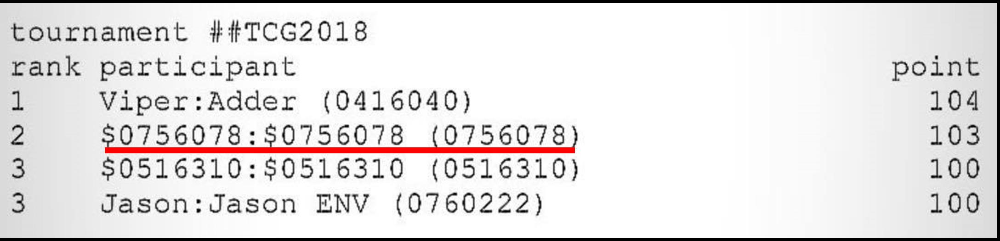

# Introduction
The final project of 2018 NCTU Theory of Computer Games (Fall), automatically playing [Threes!](https://en.wikipedia.org/wiki/Threes) puzzle game.

# Tournament
All participant in this course needs to join the final tournament for threes. Two programs are required to be implemented, the player and the hostile environment.

# Achievement
I won the second place in the final tournament of course.

